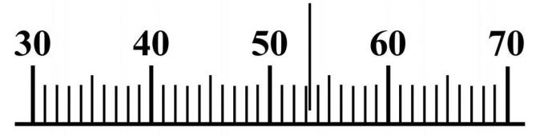
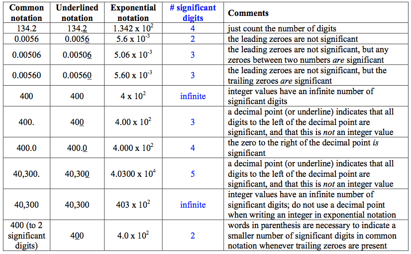

# Significant digits

-   Engineering measurements are generally accurate to at most only a
    few digits -- three digits of accuracy is considered ''standard''
    for engineering analysis

-   The number of significant digits is defined as the number of
    **relevant or useful digits** in a measurement.

-   The number of significant digits is meaningful: 0.9, 0.90, 0.900 are
    all different

-   The **best way** is the standard exponential (scientific) notation
    (count the number of digits), $1.23\times 10^{4}$

Why it is important for measurements

The rightmost zero after the decimal point counts, 53.0 means we know more than just 53, we could also find 53.1 or 52.9. 

if the rightmost zero is before the decimal point, e.g. in integeres 53200, we have difficulty to distinguish what is meaningfull so we better use scientific notation $5.32 \times 10^4$

The value is about 53, we can say even it's 53.2 - by adding .2 we mean
it's a meaningful digit, i.e. we can measure things using this tool to
the level of one digit after a decimal point, i.e.
$5.32 \times 10^{1}=0.532 \times 10^{2}$

-- So if the measure will be precisely on 53, we'll still write 53.0 
-- that's the important difference, it's not an integer value 53 and not
$0.53 \times 10^{2}$ , but $0.530 \times 10^{2}$ - three significant digits

### Rules

1.  Non-zero digits are always significant. Thus, 2.2 has two significant digits, and 22.3 has three significant digits.

1.  Zeroes:

    1.  Zeroes placed **before** other digits are **not** significant;
        0.046 has **two** significant digits.

    2.  Zeroes placed **between** **other digits** are always
        significant; 4009 kg has **four** significant digits.

    3.  Zeroes placed after other digits but **behind a decimal point**
        are significant; 7.90 has **three** significant digits.

    4.  Zeroes **at the end of a number**: USE scientific notation to be
        clear:

        -   $8.200\times10^{3}$ has four significant digits

        -   $8.20\times10^{3}$ has three significant digits

        -   $8.2\times10^{3}$ has two significant digits

Calculations

In a calculation involving **multiplication**, **division**,
**trigonometric** functions, etc., the number of significant digits in
an answer should equal **the least number of significant digits** in any
**one of the numbers** being multiplied, divided etc.

-   Thus in evaluating $\sin(kx)$ where k = 0.097 m$^{-1}$ (two
    significant digits) and x = 4.73 m (three significant digits), the
    answer should have **two** significant digits.

-   **integers** have $\infty$ significant digits, e.g. a devices uses
    1.2 kW, 2 devices use 2.4 kW.

-   When quantities are being *added or subtracted*,**[ the number of
    decimal places]{style="color: blue"}** (not significant digits) in
    the answer should be the same as **the least number of decimal
    places in any of the numbers** being added or subtracted.

### Keep One Extra Digit in Intermediate Answers

When doing multi-step calculations, [keep at least one more significant
digit in intermediate results than needed in your final answer]{.alert}.

-   For instance, if a final answer requires 2 s.d., then carry at least
    3 s.d. in calculations.

-   If you round-off intermediate answers to only two digits, a result
    the second digit in your final answer might be incorrect. (This
    phenomenon is known as round-off error.)

**The Two Greatest Mistakes Regarding Significant
Digits:**

1.   Writing more digits in an answer (intermediate or final) than justified by the number of digits in the data.

2.  Rounding-off, say, to two digits in an intermediate answer, and then writing three digits in the final answer.

### An example

Atmospheric pressure $P_{atm}=101.3$ kPa

Gage pressure measured at point 1 is 1,3[5]{.underline}0 Pa

Gage pressure is defined as $P_{gage}=P-P_{atm}$

Calculate and report the absolute pressure at position 1:

$P_{1}=101.\underline{3}+1.3\underline{5}0=$ (aligned at decimal point)
= $102.\underline{6}50$ kPa, i.e. the answer is:

$P_{1}=102.6$ kPa

if you use the value for other estimates, e.g. density or temperature,
use 102.65 kPa

Operations with signficant digits

-   Multiplication, division = first calculate, keep more significant
    digits, then round to the least number of significant digits (there
    is impossible to get "new" information beyond the known):

-   Division example:\
    $\underline{3.0}\times10^{4}/1.15\times10^{4}=2.608695...=\underline{2.6}$

-   Multiplication example:\
    $2.8723\times\underline{1.6}=4.59568=\underline{4.6}$

-   Integers do not matter:\
    $3\times0.5=1.5$\
    $222\times22=4884$

Summation/subtraction

Summation, subtraction - keep similar order of magnitude (all big ones
separately from the small ones)

Work with the decimal point - shift first, then after the operation,
round:

$3.76+14.83+2.\underline{1}=20.69 \Rightarrow 20.\underline{7}$

$4.7832+1.234+2.\underline{02}=8.0372 \Rightarrow 8.\underline{04}$

Problems are unavoidable when sum very different orders of magnitude:

$1.2\underline{3}\times 10^{5}+0.5=12\underline{3}000.0+0.5=12\underline{3}000.5 \Rightarrow 12 \underline{3}000=1.23 \times 10^{5}$

### Summary table

### Examples

603 vs 603. vs 6<u>0</u>3 $(\infty,3,2)$

0.007 =$7.\times10^{-3}$ (1), 1.005 (4)

0.01070 = $1.070\times10^{-2}$ (4)

2.00/3.0=0.666666$\ldots$=0.67 = 6.7 $\times10^{-1}$ but if you use it
for other estimates, do not round now (!), 0.66667

134,2<u>9</u>0, 0.287<u>5</u>, 29.47<u>3</u> -
round to 3 digits: 134,000 = 1.34 $\times 10^{5}$, 0.288 =
2.88 $\times10^{-3}$, 29.5

sum and answer to the proper number of significant digits:

134,290 + 0.2875 + 29.473 = ?

Solution, align decimal places: get 134319.7605 and round to the left-most least significant digits () = 134,320 = 1.3432 $\times 10^{5}$

multiply the first two and report: 134,290
$ \times$ 0.2875 = 38608.375 (if its
intermediate, otherwise 5 digits $ \times $ 4 digits = 4 digits) =
38610
