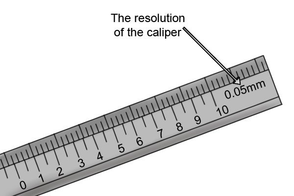

# Uncertainty 101

### Our main goal

[The science of good measurement]{.smallcaps}

**Good == accurate, low uncertainty**

### Uncertainty

{width=".9\textwidth"}

Not this kind of "uncertainty"

{width=".9\textwidth"}

Measurement uncertainty

-   Engineers are interested in the uncertainty of measurement simply
    because we wish to make good quality measurements and to
    **understand** the results.

-   Uncertainty is a **quantification of the doubt about the measurement
    result**.

-   It is important not to confuse the terms 'error' and 'uncertainty'.

Error $\neq$ uncertainty

-   Assume a rod of *true value* of 25 mm and a measured value of 24 mm,
    here error is 1 mm.

-   Error is a property of this particular measurement and value.

{width="\linewidth"}

Uncertainty is a quantification of the doubt about the measurement
result

-   The same rod and the same measured value, but **also** the measured
    value depends upon environment factor that **makes the doubt** of
    plus or minus 1 mm.

-   So the true value could be ANYTHING between 23 mm or 25 mm and
    uncertainty is 1 mm.

-   Our goal is to [quantify]{.alert} and then to [reduce]{.alert} this
    [uncertainty]{.alert}

{width="\linewidth"}

Let's repeat: error is not uncertainty
{width=".9\textwidth"}
<https://www.engineering.com/story/an-introduction-to-metrology-and-quality-in-manufacturing>

### Definitions

1.  **Measurement is:** estimate of the size, amount or degree of a
    desired quantity/parameter by using a set of instruments or devices.

2.  The result is **the best estimate with uncertainty, expressed in
    standard units**.

{width=".6\textwidth"}

based on "Good practice guide no. 131" of **The Institute of Mechanical
Engineers** <https://www.npl.co.uk/resources/gpgs>

### We use only SI

[International system of units (SI)]{.alert}

-   The International System of Units has the abbreviation SI (French).

-   The SI is at the centre of all modern science and technology and is
    used worldwide to ensure measurements can be standardized
    everywhere.

-   There are tremendous benefits to using SI units and countries
    routinely compare their SI measurement standards.

-   This keeps measurements made in different countries compatible with
    one another.

### Basic units

{width=".8\textwidth"}

### Derived units

{width=".8\textwidth"}

### Measurement science is important 

Aero-engines are built to a very high accuracy and require about
**200,000** separate measurements during production and maintenance

{width=".8\textwidth"}\
<https://www.af.mil/News/Photos/igphoto/2000589434/>

### Categories of experiments

Different categories require different uncertainty approach:

-   basic science - to learn something new about nature

-   applied science - to verify a theoretical model

-   design - to make sure two parts will fit

-   production - to determine the correct price

-   regulation - to check that that an item is within specification:
    pass/fail

In all cases, a measurement is **only** useful if: a) has high quality,
b) if suitable for the **intended purpose**.

Lord Kelvin said once: 

Measurement is as good as its uncertainty

[measurement = best estimate $\pm$ uncertainty]{.alert}

$$L = (2.35 \pm 0.03)\; \mathrm{mm  \quad (95\%)}$$

**We report:** what is measured $L$, its most probable value (2.35), its
uncertainty range (0.03) and the best known probability that this true
(95%)

If you cannot quantify the measurement uncertainty, [don't]{.alert}
start make the measurement - it is useless

<https://blog.beamex.com/calibration-uncertainty-for-dummies-part-1>

### Uncertainty analysis

1.  identify all the possible [sources]{.alert} of uncertainty,

2.  evaluate the [standard uncertainty]{.alert} from each source,

3.  [combine]{.alert} the individual standard uncertainties

Some sources of uncertainty

-   Measuring instrument: they suffer from errors.

-   Environmental conditions: some measurements are affected by varying
    in ambient conditions. e.g. calibration of slip gauge depends upon
    the coefficient of thermal expansion.

-   The instrument or gauge' being measured may change over time.

-   The measurement procedure may be difficult to perform.

-   Operator's skill: some calibration procedure requires experience
    and/or judgment skill.

You should not make any measurements unless you are aware of the related
uncertainty.

How to reduce uncertainty?

**It is important to reduce uncertainty for an accurate measurement.**
[Remember:]{.alert} you cannot eliminate uncertainty

-   Reduce the random effect by repeating the measurement process

-   Use the most suitable measuring instruments

-   Use the calibrated instrument for measurement

-   Apply correction if you know any **systematic effect**

-   Record all the uncertainty components

-   Avoid mistakes by double-checking calculations

-   Check your measurement by different operator or method.

### 8 points plan to quantify uncertainty

{width=".8\textwidth"}

### 1. Decide what you need to find out from your measurement

Identify the **type of measurement** and how it is to be measured, as
well as any **calculations\*** required in the process such as effects
that require a correction.

For this example, suppose you decide to use a set of electronic calipers
to measure the length of an object.
{width=".45\textwidth"}

\* **direct** and **indirect** measurements in the Lab

###  2. Carry out and record the measurements needed

Follow a **specified measurement procedure** to ensure that your
measurement is consistent with **standards**. Check: **the zero
reading** on your electronic calipers, you know they are **well
maintained** and **calibrated**, and then you took **repeated
readings**.

{width=".3\textwidth"}

### Notebook should be clear

**a date**, **name**, **the instruments**, **a note of the calibration
sticker on the calipers**, and **a record of the temperature**. [This is
good practice and pays off by 5% bonus for lab notebooks]{.alert}

{width=".3\textwidth"}

### Outliers and averaging

-   Because the numbers are laid out neatly, it makes it easy to spot
    that Measurement 3 is out of line with the others. Having confirmed
    with the partners this is **a mistake**, you can cross it out
    without making it illegible.

-   In **statistical terms**, this reading is considered **an outlier**
    and is clearly not part of the natural variability of measurement.
    It is therefore ignored in any further calculations and you simply
    take the average of the other 24.

-   This gives your best estimate of the length as:
    $$(21.53 + 21.51 + 21.47 + 21.43 +...) / 24 = 21.493\, \mathrm{mm}$$

### 3. Evaluate the uncertainty of each input quantity that feeds in to the final result (Type A and Type B evaluations). Express all uncertainties in similar terms (standard uncertainties)

{width=".8\textwidth"}

Type A uncertainty

-   **Type A** uncertainty evaluations are carried out by **statistical
    methods**, usually from repeated measurement readings. In this case,
    you have 24 readings and have used these to gain an average of
    21.493 mm.

### 3. continued \...

-   **Type B** uncertainty evaluations are carried out using any other
    information such as past experiences, calibration certificates,
    manufacturers specifications, **from calculation**, from published
    information and from common sense. In this example you can consider
    **the calibration of the calipers.**

-   Both of these uncertainties need to be expressed in similar terms so
    that you can **compare and combine** them. So you need to associate
    a number -- called a ["standard uncertainty"]{.alert} -- with each
    term.

### Type A uncertainty evaluation

For [Type A]{.alert}: characterize the variability of $n$ readings by
their **standard deviation**, given by the formula below

$$\mathrm{STD} = \sqrt{\frac{\sum\limits_{i=1}^{n} \left( x_i - \bar{x} \right)^2 }{n-1}}$$

$$= \sqrt{\frac{\left( 21.53 - 21.493 \right)^2  + \left( 21.51 - 21.493 \right)^2 + ... }{24 -1 }}  = 0.1044$$

This is [standard deviation of a single measurement !]{.alert}

### Write it clear in your notebook 

Of course one could glue (white glue, no marking) a print from a Python
notebook

{width=".8\textwidth"}

### Type A standard uncertainty of average

**Average (mean) is the random variable by itself.**

For $n$ readings the [standard uncertainty associated with the
**average**]{.alert}:

[standard uncertainty]{.alert} = STD / $\sqrt{n}$

The standard uncertainty associated with the average is thus:

$$0.1044\, \mathrm{mm}/\sqrt{24} = 0.021 \mathrm{mm}$$

### Type A standard uncertainty

This uncertainty is based upon the idea that the readings were drawn
from a **normal probability distribution**. Using 24 readings we
estimate **the characteristics of this distribution** -- and then worked
out the standard uncertainty -- [how well one can estimate the position
of the centre of the distribution]{.alert}.

{width=".45\textwidth"}

### Type B uncertainty evaluation

-   Type B uncertainty evaluation is needed to assess uncertainties
    where statistics are not applicable, **for example** where there are
    [biases]{.alert} -- **errors which always affect the reading in the
    same way**.

-   In order to compare the uncertainty from Type A and Type B
    evaluation you need to convert **the range of the rectangular
    distribution into a standard deviation** to be used as **the
    standard uncertainty**.

Typical sources of Type B

{width=".45\textwidth"}

-   Calibration - we do not know what how the calibration was performed

-   Use of different instruments (old/new, different resolutions, etc.)

-   Different operators, human factor

-   Environmental factors, external parameters (electromagnetic noise,
    temperature in the room)

ISO guidelines

ISO guidelines: **assume that any error or bias is a random draw from a
known statistical distribution.**

Then we use the standard deviation from that assumed distribution. Our
basic options are:

1.  **Uniform**, all equally probable within the range, zero probability
    outside

2.  **Triangular**, central more probable within the range

3.  **'t' or "Student"**, random, all probable, for small $n<20$

4.  **Gaussian or normal**, random, all probable, $n>20$

Probability and distributions
{width=".9\textwidth"}
<https://www.muelaner.com/uncertainty-of-measurement/>

Uniform distribution

Most conservative estimate of uncertainty, largest standard deviation

We assume that we know the end points

All the effects within the range are equaly likely

$$f(x)=\frac{1}{B-A} \; \mathrm{for} \; A\leq x\leq B$$

Mean: $\frac{A+B}{2}$ and standard deviation:
$\sqrt{\frac{(B-A)^{2}}{12}}$

When we work with $-a\leq x\leq a$, then we get

$$s=\frac{1}{\sqrt{3}}a$$

Triangular distribution

-   Less conservative estimate of uncertainty

-   Smaller standard deviation

-   We assume the range and take it symmetric for simplicity:

-   For $-a\leq x\leq a$:

    $$s=\frac{1}{\sqrt{6}}a$$

### Back to Type B in our example

standard uncertainty = half range/$\sqrt{3}$

-   In this example, the calibration certificate simply states that the
    device will read within $\pm 0.02$ mm of the correct value, if it is
    used correctly and the temperature is within the range 0$^\circ$C to
    40$^\circ$C.

-   The standard uncertainty associated with the calibration of the
    device is thus
    $$0.02 \, \mathrm{mm}/\sqrt{3} = 0.012 \, \mathrm{mm}$$

### Summary of uncertainty types

{width=".8\textwidth"}

### 4. Decide whether the errors of the input quantities are independent of each other 

-   Could a large error in one input cause a large error in another?

-   Could an outside influence such as temperature have a similar effect
    on several aspects of uncertainty at once?

-   If the errors are independent, which is typical and assumed in this
    example, you can use the formula in step 6 to calculate combined
    standard uncertainty. If not, extra calculations are needed, come to
    the next lecture.

[Assuming that there is no correlation can lead to an unreliable
uncertainty evaluation.]{.alert}

### 5. Calculate the result of your measurement (including any known corrections, such as calibrations)

-   You get your result from the mean reading and by making all
    necessary corrections to it, such as **calibration corrections**
    listed on a calibration certificate or manufacturer's specifications
    to correct temperature drift, etc.

-   In this example you do not have any certificate corrections to
    include. But if you did, they **would be added to the original mean
    reading** of 21.493 mm.

### 6. Find the combined standard uncertainty from all the individual uncertainty contributions

So in order to evaluate the uncertainty we add the components "in
quadrature" (also known as "the root sum of the squares"). The result of
this is called the "combined standard uncertainty".

$$u = \sqrt{ \left( p^2 + b^2 \right)}$$

-   Type A -- from the variability of the data, probability $p$

-   Type B -- from the calibration certificate, bias, $b$

### And our combined uncertainty is \... 

$$u = \sqrt{ (0.021)^2 + (0.012)^2} = 0.024 \, \mathrm{mm}$$

The best estimate of the length is the average of the 24 readings. The
associated standard uncertainty is evaluated by combining (in
quadrature) the standard uncertainties relating to the main factors that
could cause the calipers to read incorrectly.

### 7. Calculate expanded uncertainty for a particular level of confidence

-   The combined standard uncertainty is equivalent to [one standard
    deviation]{.alert}, the $\mu \pm 1\sigma$ covers about 68% of the
    normal distribution.

-   Increase the level of confidence that **the true answer lies within
    a given a range**, by multiplying the standard uncertainty by a
    coverage factor to give an expanded uncertainty:

    $$U = k \times u$$

-   Expanded uncertainty: increase the confidence level to 95% or even
    99% by combining with the appropriate coverage factor (assuming a
    normal distribution).

{width=".8\textwidth"}

### 8. Write down the measurement result and the uncertainty, and state how you got both of these

[It is important to express the result in your report so that a
reader/boss/user/client can use the information]{.alert}

The main things to mention are:

-   The measurement result, together with the uncertainty

-   The statement of the coverage factor and the level of confidence:

    $$\ell = 21.49 \pm 0.05 \, \mathrm{mm}$$

    *The reported uncertainty is based on a standard uncertainty
    multiplied by coverage factor $k = 2$ , providing a level of
    confidence of approximately $95\%$, assuming normality.*

An example 1/2

{width=".9\textwidth"}

<https://www.muelaner.com/uncertainty-budget>

An example, 2/2 {width=".9\textwidth"}

<https://www.muelaner.com/uncertainty-budget/>

### Eight steps to get the correct measurement

{width=".8\textwidth"}

###  This is just the simplest case 

This is a simple example, we do not deal with special cases where
different rules apply such as:

-   Small number of repeated readings -- "Student" distribution

-   If one aspect of uncertainty dominates the calculation

-   If the inputs to the calculation are correlated

Combination of uncertainties

-   We measured $N$ physical quantities (variables),
    $x_{1},x_{2},\ldots,x_{N}$ (voltage, resistance, power, torque,
    length), each has its own uncertainty, $u_{x_{i}}$ (component
    uncertainty): $$x_{i}=\overline{x_{i}}+u_{x_{i}}$$

-   We want to estimate uncertainty of the result $R$ that depends on
    the measured ones: $y=f(x_{1},x_{2},\ldots,x_{N})$.

-   We need to estimate $u_{y}$, using $u_{x_{i}}$ to obtain:
    $$y=\overline{y}\pm u_{y}$$

-   **Two** **types**: [maximum]{.alert} (worst case) or
    [expected]{.alert} (probabilistic)

Theory of uncertainty analysis Taylor expansion

$$y + u_y = f(x_1 + u_{x_1}, x_2 + u_{x+2}, ... )  =$$

$$= f(x_1, x_2 , ...) + \frac{\partial f}{\partial x_1} u_{x_1} +  \frac{\partial f}{\partial x_2} u_{x_2} + ...  +$$

$$+ \frac{1}{2} \left( (u_{x_1} )^2 \frac{\partial^2 f}{\partial x_1^2} +  ...   \right)$$

Maximum uncertainty

$$u_{y,\mathrm{max}}=\sum_{i=1}^{i=N}\left|u_{x_{i}}\frac{\partial y}{\partial x_{i}}\right|$$

-   We assume that all the errors in the component measurements will
    **ADD** to the uncertainty of $R$, i.e. will be always of the same
    sign.

-   This is worst case scenario, unlikely for large number of variables
    (large $N$), but happens when we have a direct effect or a bias
    error (broken ruler, wrong diameter of spheres in cone measurements,
    lab A)

Expected uncertainty

Root of the sum of squared uncertainty, RSS:

$$u_{R,\mathrm{RSS}}=\sqrt{\sum_{i=1}^{i=N}\left(u_{x_{i}}\frac{\partial R}{\partial x_{i}}\right)^{2}}$$

-   More realistic for large number of variables or for very different
    variables (using different instruments, randomization)

-   ISO standard if not stated otherwise: $u_{R}=u_{R,\textrm{RSS}}$

-   We known that $R=\overline{R}+u_{R}$ at the same confidence level as
    the components, typically 95% confidence level

-   Use dimensionless $u_{R}/R$

Detailed example Measure volume flow rate, $Q$ using the "bucket"
method, measure the time it takes to fill some volume
$\forall$$$Q=\forall/t$$

-   Measured: $\forall=1.15\pm0.05$ liter, $t=33.0\pm0.1$ sec, both with
    95% confidence

-   $Q=\forall/t=1.15/33.0\left(60\,\textrm{s}/\textrm{min}\right)=2.0909\Rightarrow2.09$
    liter/min (lpm) (note 3 sig. dig.)

-   Partial derivatives: $\partial Q/\partial\forall=1/t$,
    $\partial Q/\partial t=-\forall/t^{2}$

-   $R=Q$, $u_{\forall}=0.05$ liter, $u_{t}=0.1$ sec.

The maximum, worst case method

$$u_{R,max}=\left|u_{\forall}\frac{\partial Q}{\partial\forall}\right|+\left|u_{t}\frac{\partial Q}{\partial t}\right| =$$

$$= u_{\forall}\frac{1}{t}+u_{t}\frac{\forall}{t^{2}}=$$

$$0.05\times\frac{1}{33.0}+0.1\times\frac{1.15}{33.0^{2}}=$$

$$= 0.00162\times60=0.0972\, \mathrm{lpm}$$

### The expectation method

$$u_{R,\textrm{RSS}}=\sqrt{\left(u_{\forall}\frac{\partial Q}{\partial\forall}\right)^{2}+\left(u_{t}\frac{\partial Q}{\partial t}\right)^{2}}=$$

$$= \sqrt{\left(u_{\forall}\frac{1}{t}\right)^{2}+\left(u_{t}\frac{\forall}{t^{2}}\right)^{2}}=$$

$$=\sqrt{\left(0.05\times\frac{1}{33.0}\right)^{2}+\left(0.1\times\frac{-1.15}{33.0^{2}}\right)^{2}}=$$

$$= 0.00152\times60=0.0911 \, \mathrm{lpm}$$

The full and correct answer is $Q=2.09\pm 0.0911$ lpm (with 95%
confidence)

What do we learn from the analysis ?

The **contribution of each variable to the overall uncertainty**:

-   $u_{\forall}/\forall=0.05/1.15=4.35\%$

-   $u_{t}/t=0.1/33.0=0.303\%$

-   $u_{Q}/Q=0.0911/2.09=4.35\%$

-   If we want to improve the result, which measurement shall we improve
    first?

Continued \...

-   For instance, improving the time accuracy and reducing it
    uncertainty by the factor of two will not affect the result at all.

-   Instead, improving volume by the factor of two $\forall=1.150+0.025$
    liters will cause $Q=2.09\pm0.046$ lpm - significant improvement.

Last example, how to save money for your startup

-   Shaft rotation speed measured by stroboscope with many repetitions.
    $\overline{N}=1734.2$ rpm, $S_{N}=1.45$ rpm.

-   Strobe accuracy by manufacturer $\pm 1.00$ rpm

-   $u_{\textrm{measurement}}=\pm 2\sigma=\pm 2.90$ rpm (95%)
    $u_{\textrm{instrument}}=\pm1.00$ rpm

-   $u_{N}=\sqrt{u_{\textrm{meas.}}^{2}+u_{\textrm{instr.}}^{2}}=\sqrt{2.90^{2}+1.00^{2}}=3.068$
    rpm

-   The final result is:
    $$N=1734.2\pm3.07\,\textrm{rpm} (95\% \mathrm{c.l.})$$

-   The uncertainty is due to **the measurement uncertainty**, thus a
    more expensive tool will not help.
